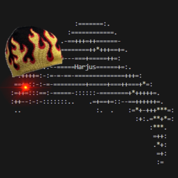

# Harjus

<!-- PROJECT LOGO -->
<br />
<div align="center">
  <a href="https://github.com/ValtteriL/harjus">
    
  </a>

  <h3 align="center">Harjus</h3>

  <p align="center">
    Binance Spot Arbitrage Bot
    <br />
    <a href="https://shufflingbytes.com/posts/binance-triangular-arbitrage/"><strong>Read the writeup »</strong></a>
  </p>
</div>

## Demo

Exploiting triangular arbitrage opportunities in Binance testnet
[](https://asciinema.org/a/730934)

## Requirements

- VirtualBox
- Vagrant
- VSCode with Remote - SSH extension

### For deployment

- AWS CLI
- Terraform
- Ansible

## Development

Development is done inside a Vagrant VM accessed via VSCode Remote SSH. The VM provides a consistent development environment with all necessary dependencies pre-installed.

```bash
vagrant up
```

By default, the VM is allocated 50% of your host's CPU and RAM. You can override this with environment variables:

```bash
# Allocate 8 CPUs and 16 GB RAM
VM_CPUS=8 VM_RAM_GB=16 vagrant up
```

### List available commands

```bash
just
```

## Build

```bash
# debug build
just build

# release build
just build-release
```

## Test

```bash
just test
```

## Run

```bash
# debug build
just run

# release build
just run-release
```

## Deployment

```bash
# Create Terraform backend in S3
just deploy::init-backend

# Provision host
just deploy::provision-host
```
